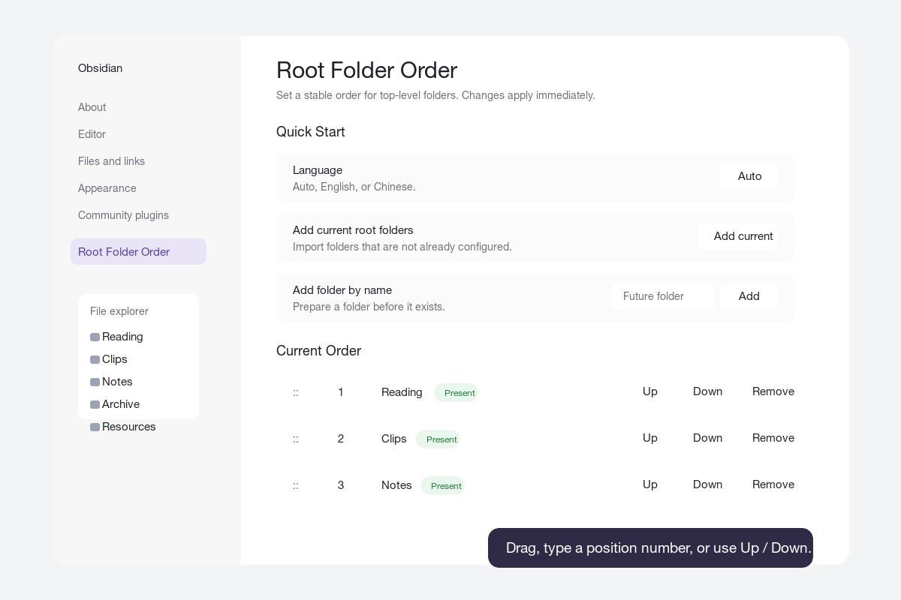

# Root Folder Order for Obsidian

Root Folder Order keeps the folders at the top level of your Obsidian vault in a custom order.

Use it when your vault has a fixed structure such as:

```text
Reading
Clips
Notes
Archive
Resources
```

or:

```text
读书
剪藏
笔记
归档
资源
```

Obsidian can sort files and folders by its built-in rules, but many vaults need a stable root structure that does not change just because a folder name changes. This plugin only changes the order of root-level folders in the file explorer. Notes and nested folders keep Obsidian's normal sorting behavior.



## Features

- Sort root-level folders in a custom order.
- Reorder with drag and drop.
- Reorder by typing a position number.
- Reorder with Up and Down buttons.
- Add all current root folders with one click.
- Add a future folder by name before it exists.
- Mark configured folders as present or missing.
- Create a missing configured folder from the settings page.
- Optionally auto-add new root folders.
- Optionally track root folder renames.
- Optionally remove deleted root folders from the order.
- Settings UI in English and Chinese.
- No build step or runtime dependencies.

## Installation

### Obsidian Community Plugin Directory

1. Open `Settings -> Community plugins` in Obsidian.
2. Search for `Root Folder Order`.
3. Install and enable the plugin.

### Manual Install

1. Download the latest release from [GitHub Releases](https://github.com/chilohwei/obsidian-root-folder-order/releases/latest).
2. Copy these files into your vault:

```text
<your-vault>/.obsidian/plugins/root-folder-order/
```

Required files:

```text
main.js
manifest.json
styles.css
```

3. Restart Obsidian or reload community plugins.
4. Open `Settings -> Community plugins`.
5. Enable `Root Folder Order`.

### BRAT Install

If you use the BRAT plugin, add this repository:

```text
chilohwei/obsidian-root-folder-order
```

## Quick Start

1. Open `Settings -> Community plugins -> Root Folder Order`.
2. Click `Add current` to import the current root folders.
3. Reorder folders by dragging rows, clicking `Up` / `Down`, or editing the position number.

Changes are saved immediately and the file explorer refreshes in real time.

## Settings

### Quick Start

- `Language`: Auto, English, or Chinese.
- `Add current root folders`: Adds root folders that are not already in the list.
- `Add folder by name`: Adds a root folder name to the order list, even if the folder does not exist yet.

### Current Order

Each configured folder row includes:

- Drag handle for drag-and-drop sorting.
- Position number for direct ordering.
- Folder status: present or missing.
- `Up` and `Down` buttons.
- `Create` button when the folder is missing.
- `Remove` button to remove it from the configured order.

### Advanced Options

- `Configured folders position`: Show configured folders before or after unconfigured root folders.
- `Unconfigured folders`: Keep Obsidian order, sort A to Z, or sort Z to A.
- `Auto-add new root folders`: Append newly created root folders to the configured order.
- `Track root folder renames`: Update saved entries when configured root folders are renamed.
- `Remove deleted root folders`: Remove configured entries when root folders are deleted or moved away from the vault root.
- `Remove missing entries`: Clean up configured folders that no longer exist.
- `Reset to current root folders`: Replace the order list with all current root folders.
- `Bulk edit`: Paste one root folder name per line and apply it as the new order.

## Common Use Cases

### Personal Knowledge Base

Recommended configuration:

- Configured folders position: `Top`
- Unconfigured folders: `Use Obsidian order`
- Track root folder renames: `On`

### Shared Vault

Recommended configuration:

- Auto-add new root folders: `On`
- Track root folder renames: `On`
- Remove deleted root folders: `On`

### Vault Cleanup or Migration

Useful actions:

- Use `Bulk edit` to paste a clean folder list.
- Use `Create` to create missing root folders.
- Use `Remove missing entries` after reorganizing the vault.

## Chinese Guide

Root Folder Order 用于固定 Obsidian vault 顶层目录在文件列表中的显示顺序。

适合这类结构：

```text
读书
剪藏
笔记
归档
资源
```

插件只影响 vault 根目录下的一级目录。子目录和笔记仍然使用 Obsidian 原本的排序方式。

### 快速开始

1. 打开 `设置 -> 第三方插件 -> Root Folder Order`。
2. 点击 `添加当前`，导入当前根目录。
3. 通过拖拽、`上移` / `下移`，或直接输入序号来调整顺序。

所有改动都会立即保存，并实时刷新文件列表。

### 常用配置

- `语言`：自动、English、中文。
- `添加当前根目录`：把还不在列表里的根目录加入排序。
- `按名称添加目录`：即使目录还不存在，也可以先加入排序列表。
- `高级选项`：包含未配置目录排序、自动添加新根目录、重命名跟踪、删除清理、批量编辑等功能。

## Development

This repository is intentionally simple. The plugin is plain JavaScript and does not require a build step.

Run local checks:

```bash
node --check main.js
node -e "const fs=require('fs'); for (const f of ['manifest.json','versions.json']) JSON.parse(fs.readFileSync(f,'utf8'));"
```

For local development, copy or clone this repository into:

```text
<your-vault>/.obsidian/plugins/root-folder-order
```

Then reload Obsidian and enable the plugin.

## Release Notes for Maintainers

For Obsidian community plugin releases:

- Keep `manifest.json` at the repository root.
- The GitHub release tag must exactly match `manifest.json` version, for example `1.0.0`.
- Attach `main.js`, `manifest.json`, and `styles.css` to the GitHub release.
- Prefer the `Release` GitHub Actions workflow so release assets receive artifact attestations.
- Keep personal vault configuration such as `data.json` out of the release.

To publish a release:

```bash
git tag 1.0.3
git push origin 1.0.3
```

After the workflow finishes, verify the released assets:

```bash
gh release verify 1.0.3 --repo chilohwei/obsidian-root-folder-order
gh release download 1.0.3 --repo chilohwei/obsidian-root-folder-order --dir /tmp/root-folder-order-verify --clobber
gh attestation verify /tmp/root-folder-order-verify/main.js -R chilohwei/obsidian-root-folder-order
gh attestation verify /tmp/root-folder-order-verify/manifest.json -R chilohwei/obsidian-root-folder-order
gh attestation verify /tmp/root-folder-order-verify/styles.css -R chilohwei/obsidian-root-folder-order
```

## License

MIT
